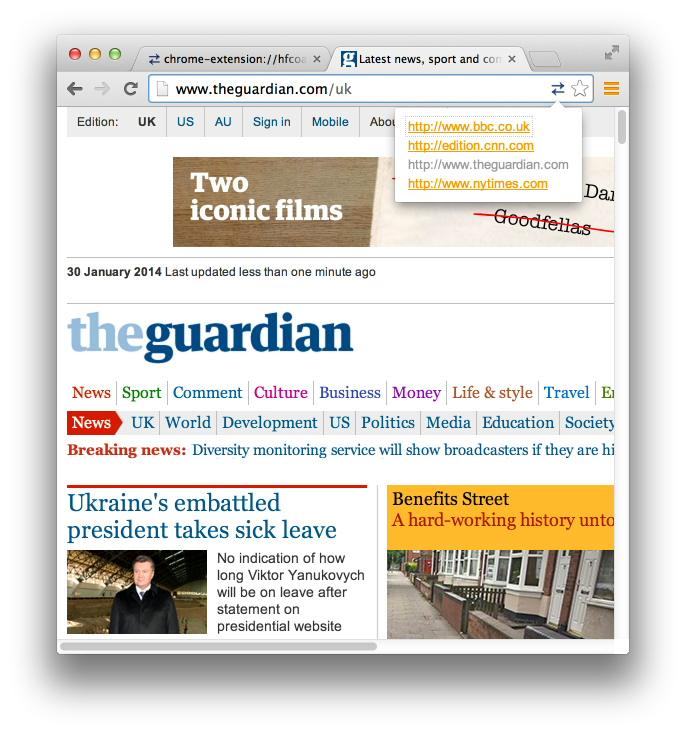

##Switcher
The idea for this extension came from working on an internal booking.com Chrome extension to help our frontend developers and designers test their experiments. 

Switcher is meant to be a Chrome extension boiler-plate that others can build upon. To show what's possible, it includes functionality to allow you to switch between developement, staging and production versions of a website.

But you are not constrained to just that. You can create multiple groups of sites - even sites that are not necessarily development, staging or production versions of each other. For example, you could bundle all the news sites in one group and switch between them:

But more than that, I hope it's something useful that you can extend.

I'd like to thank my employer - booking.com - for allowing me to publish this code under a permissive MIT license.

Haven't installed a Chrome extension froms source before? Follow these steps:

1. In Chrome's address bar, type: chrome://extensions
2. Click the 'Developer mode' checkbox
3. Click the 'Load unpacked extension...' button and point the file open dialog to the folder where you downloaded/cloned Switcher.
